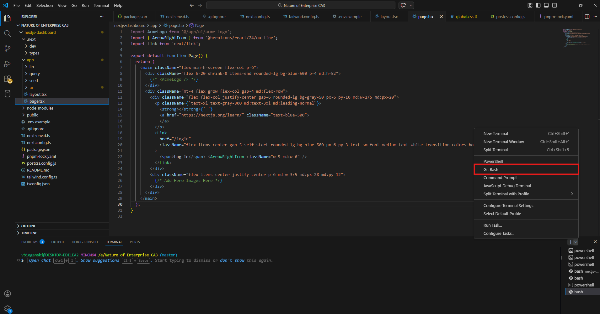
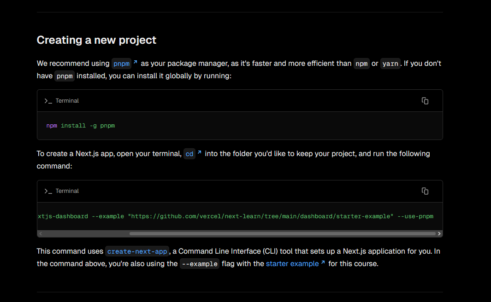

In order to run this project locally, you need to do the following:
1: install nodejs, https://nodejs.org/en/download
2: clone the git repo locally
3: open the folder in vscode
4: open a new git bash terminal in vscode (screenshot below)

5: install pnpm by running the following command in the git bash terminal: npm install -g pnpm
6:follow the startup guide here: https://nextjs.org/learn/dashboard-app/getting-started#exploring-the-project
Note: Do not do these following steps, as that will create a new nextjs-dashboard

